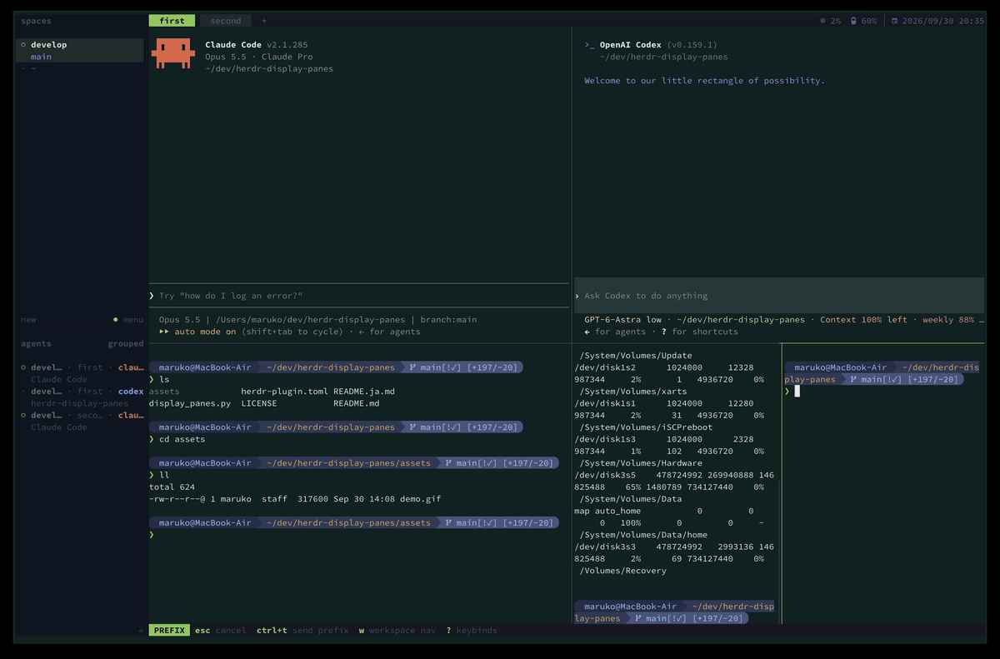

# herdr-display-panes

[日本語](README.ja.md)

tmux's `display-panes` for [Herdr](https://herdr.dev).



Press one key to open a popup with a map of the panes in the current tab.
Each pane gets a one-key label, top-left first: the home row
(`a` `s` `d` `f` `g` `h` `j` `k` `l`), then the top row (`w` … `p`) and the
bottom row (`z` … `m`), up to 25 panes. Press a label to focus that pane.

```
┏━ ● current ━━━━━━━━━━━━━━━━━━┓┌──────────────────────────────┐
┃                              ┃│                              │
┃          ▐█  A  █▌           ┃│          ▐█  S  █▌           │
┃                              ┃│                              │
┃            claude            ┃│            codex             │
┃      fix-login-redirect      ┃│          review PR           │
┗━━━━━━━━━━━━━━━━━━━━━━━━━━━━━━┛└──────────────────────────────┘
Press a key to jump / q or Esc to close
```

- **Keycap badges**: each pane's key is shown on a colored badge. Agent panes
  are colored, shell panes are gray. Badges shrink to fit small panes and stay
  the same size across the map.
- **Current pane stands out**: a tinted background, a heavy border and a
  `● current` title; the other panes are dimmed.
- **Agent info**: agent panes show the agent name and session title; shell
  panes show the working directory.
- **Your colors**: pick one color for all agents, or a color per agent
  (see [Configuration](#configuration)). Neutral colors follow your terminal's
  background and foreground, so light and dark themes both work.
- **Plain text**: no graphics protocol needed, so it works in any terminal.
- The popup closes on `q`, `Esc`, or after 10 seconds.

## Requirements

- Herdr 0.9.2 or newer
- macOS or Linux (tested on macOS)
- `python3` (3.8+, standard library only)

## Install

```sh
herdr plugin install abroller666/herdr-display-panes
```

To pin a release, pass `--ref`:

```sh
herdr plugin install abroller666/herdr-display-panes --ref v0.2.0
```

Add a keybinding to `~/.config/herdr/config.toml`:

```toml
[[keys.command]]
key = "prefix+i"
type = "plugin_action"
command = "abroller666.display-panes.open"
description = "display panes"
```

Then reload: `herdr server reload-config`.

## Configuration

Optional. Create `config.json` in the plugin config directory
(`herdr plugin config-dir abroller666.display-panes`):

```json
{
  "labels": "asdfghjklwertyuiopzxcvbnm",
  "timeout": 10,
  "agent_color": "#9ece6a",
  "agent_colors": {
    "claude": "#d97757",
    "codex": "#7aa2f7"
  }
}
```

- `labels`: keys assigned to panes, top-left to bottom-right. Duplicates and
  `q` are ignored. At most `len(labels)` panes get a label.
- `timeout`: seconds before the popup closes by itself.
- `agent_color`: border and badge color for agent panes (`#rrggbb` or `#rgb`).
  Defaults to green.
- `agent_colors`: per-agent overrides keyed by agent name (case-insensitive).
  Agents not listed use `agent_color`.

## License

MIT
